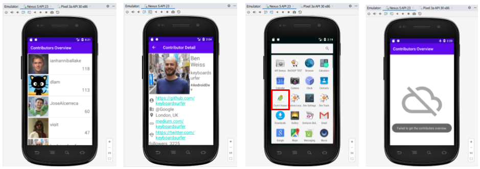
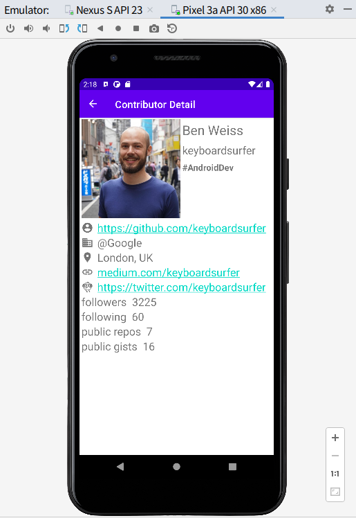

# Contri Viewer
Android Architecture Components samplesリポジトリの contributors を確認閲覧(viewer)する Android アプリ

## misc ディレクトリについて

- misc ディレクトリには、Contri Viewer 開発版のスナップショットと APK を配置しています。

## snapshot

- 2021/07/05 14:00  
  

## アプリについて

- 画面遷移を Fragmentを使った Navigationで管理しています。  
アプリ実態は SPA(シングルページアプリケーション)になっており、  
画面間のパラメータ受け渡しには、Safe Argsを利用しています。

- ViewModel を使って、画面表示に関する状態を管理しています。  
このため画面の縦横回転を行っても表示が維持されます。  
またLiveDataを使って状態と View表示の同期を図っています。

- コントリビュータ情報をリポジトリパターンで管理しています。  
ViewModelは、リポジトリからコントリビュータ情報をもらい、View表示用のモデルにコンバートします。  
GitHub API アクセスは、リポジトリ内に閉じています。

  - GitHub API アクセスは、一般的なライブラリ Retrofit と Moshi を使っています。  
    ネットワーク処理は、Coroutine を使って IO スレッド下で 非同期で実行されす。  
    また viewModelScope で実行されるため画面ライフサイクルに従属します。
  - リポジトリは、コントリビュータ情報をキャッシュします。
  - リポジトリは、アプリケーションスコープで管理されます。  
  このため Activityが破棄されてもキャッシュは残るので、画面再表示に利用できます。

- (MVPに近い) MVVMを模した、View(ViewBinding)、ViewModl、Model(ContriViewerRepository)構成になっています。  
各層間は、インターフェースを介した通知による相互協調を行っています。  
ViewBindingは 表示関係に徹し、Repositoryは、コントリビュータ情報の取得と管理に徹し、  
ViewModelは、ViewとModel(Repository)との仲介に徹します。

- テストコードでは、Coroutine によるフェッチ成功と失敗時の挙動動作確認を行っています。
  - Unit test だけでなく、Instrumented test によるエミュレータでの動作再現確認を行っています。

- テストのためにオリジナルの簡易DIを使っています。(Hiltなどは使っていません)
  - 簡易依存性注入クラス ⇒ SimpleInjector()  
    テスト時のみ「依存元オブジェクトの実態」を指定のテスト用のインスタンスに差し替える簡易DIです。

- その他
  - GitHub API コントリビュータ一覧情報処理は、ページネーションを追加して最大限取得するようにしています。
  - 通信エラー時は、画面に通信不能アイコン(雲にスラッシュ)を表示します。
  - 一覧画面は、スワイプダウンでコントリビュータ情報の再読込を行います。  
    キャッシュを併用しているためスワイプダウンが有効になるのは、5分後としています。

アプリでやっていないこと  
*MVVM + Repositoryパターン、Coroutine非同期処理の優先確認から、以下は行っていません。*

- マテリアルデザインの Themeや Widget使った UI表示を行っていません。
- コントリビュータ情報の永続化は行っていません。  
このためアプリを終了させるとキャッシュもクリアされます。
